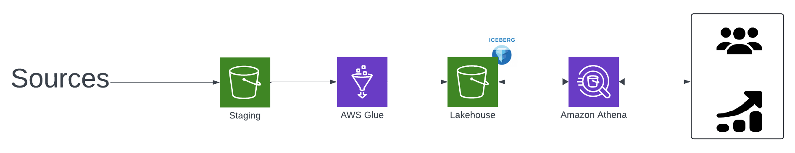

# Open Table Formats
## The Foundation of the Data Lakehouse

---

# Me

* Long time data person holding various roles over the years
* Consultant specializing in Data Engineering and Architecture
* Working with AWS since 2017
* 4x AWS Certified

---

# Data Lakehouse Intro

* First there was the Data Warehouse
* Then the Data Lake
* And now a hybrid approach called Data Lakehouse

<!--
Data Warehouses were all the rage.  Before Data Warehouses, it was difficult to write BI and analytical queries (ie OLAP) against application databases.  They were often slower as well.   OLAP queries became easier and faster in a Data Warehouse.  Data Warehouse were also expensive to build and operate.

Data Lakes were a cheaper than Data Warehouses and they were often pitched as a replacement to Data Warehouses.  Not only could you store tabular data, you could store unstructured and semi-structured data.  And lots of it.  Sounds great, but what happens when you need to delete data for compliance reasons or update a customer address?   Nothing makes you miss databases quite like working with data lakes.  

I gave a talk 5 years ago to this group about using Athena to query data in an s3 Data Lake

And now, Data Lakehouses, a hybrid approach.  An attempt to combine the good things about Data Warehouses and Data Lakes
-->

---

# Open Table Formats Intro

* The most important tech behind Data Lakehouses
* A layer that sits on top of object stores that brings database-like features to Data Lakes
* Delivering on the Data Lake hype
* Better than Data Lakes for tabular data
* Cheaper than Data Warehouses

<!--
Data Lake are still a good fit for append-only workloads and unstructured data

Not file formats (parquet or orc)
-->

---

# Open Table Formats Intro

* The Database-Like features
    * ACID transactions
    * Deletes, updates and inserts
    * Time Travel queries
    * Schema Evolution
* The players
    * Delta Lake
    * Apache Hudi (Hoodie)
    * Apache Iceberg
    * All 3 are good and all 3 are on the same path
    
<!--
Database-Like Features

- ACID –transactions – The king of database like features

- Deletes – for compliance reasons.  A user wants all their data removed 

- Updates which can be handy for Slowly Changing Dimensions

- Time Travel so we view our data has things change

- Schema Evolution including Adds, Drops and Type Promotions

The Players

- Delta Lake – Open source, but heavily controlled by Databricks.  The default choice if you’re Databricks and Azure
- Apache Hudi. Pronounced Hoodie.  The most mature of the three.  Started at Uber.  Strong in the streaming space
- Apache Iceberg – Started at Netflix – Lots of momentum and backing from big vendors such as Snowflake, Confluent, Dremio, AWS and Cloudera
- and there are things like Apache XTable that act as a universal interface to these 3.  Maybe some commercial solutions as well

We’ll be focusing on Iceberg for the rest of the presentation

-->

---

# The role of Data Lakehouse in a Data Platform

<!--
Lakehouse can fulfill your OLAP needs as long as you can live with performance :-)

Spark and SQL(Presto or Trino or Athena) are two popular ways to write, update and read data stored in open table formats.   Another way is Flink

-->

---

# The role of Data Lakehouse in a Data Platform

<!--
And Lakehouses can be complementary to Data Warehouses where Data Warehouses handle queries that require faster response time

-->

---

# Athena and Iceberg Demo